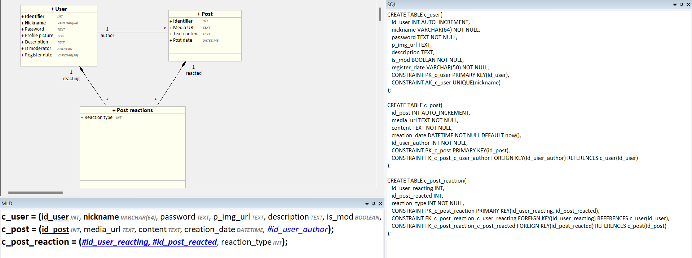
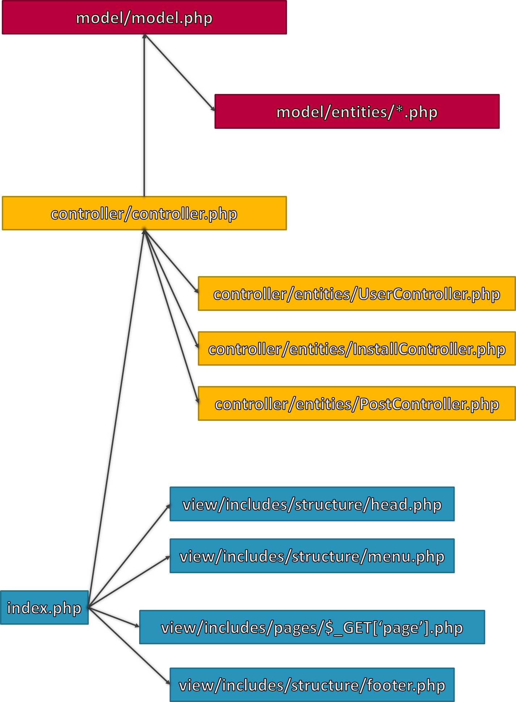

# Contributing to Convergence

All information related to contributing to the project can be found in this file. It is **mandatory** to read it before contributing to the project in order to follow the conventions and make the development process easier for everyone. Thank you for your understanding!

- [Contributing to Convergence](#contributing-to-convergence)
	- [Getting the Project](#getting-the-project)
	- [Installation \& Launch](#installation--launch)
		- [Via Docker](#via-docker)
			- [Prerequisites](#prerequisites)
				- [Install WSL to use Docker on Windows](#install-wsl-to-use-docker-on-windows)
				- [Install Docker on Linux/WSL](#install-docker-on-linuxwsl)
			- [Launch Docker Composition](#launch-docker-composition)
		- [Locally (not recommended)](#locally-not-recommended)
	- [Technical Design](#technical-design)
		- [Development Environment](#development-environment)
		- [Entity Relationship Diagram](#entity-relationship-diagram)
	- [Project Conventions](#project-conventions)
		- [Versioning](#versioning)
		- [Git](#git)
		- [Code](#code)
			- [Code conventions](#code-conventions)
			- [Indentation](#indentation)
			- [Code Quality](#code-quality)
	- [Documentation](#documentation)
		- [How a request is handled](#how-a-request-is-handled)
		- [How errors are handled](#how-errors-are-handled)
		- [How a page is structured](#how-a-page-is-structured)
		- [How the app is structured](#how-the-app-is-structured)
			- [Model](#model)
			- [Controller](#controller)
			- [View](#view)
				- [Inclusion](#inclusion)
				- [Graphic charter](#graphic-charter)

## Getting the Project

The project is hosted in an online repository. It is recommended to associate your SSH keys with your account to clone the project via SSH for security reasons, but it is also possible to clone it via HTTPS.

Navigate to the folder where you want to clone the project (after creating it):  
On Windows:

```bat
cd %userprofile%\Documents\Projects\
```

On Linux:

```bash
cd ~/projects/
```

Clone via SSH:  

```bash
git clone git@github.com:MichaelAceAnderson/Convergence.git
```

Clone via HTTPS

```bash
git clone https://github.com/MichaelAceAnderson/Convergence.git
```

## Installation & Launch

### Via Docker

The application can run in a Docker container. To do this, you need to install Docker and Docker Compose, then launch the Docker composition.

Running the project directly locally is less recommended as it requires time-consuming installation and configuration of several applications (Nginx/PHP/MariaDB). Therefore, using Docker to launch the application is preferred.

#### Prerequisites

To launch the project via Docker, Docker and Docker Compose must be installed, which are not directly available on Windows (at least not via command line).

##### Install WSL to use Docker on Windows

You can use WSL (Windows Subsystem for Linux) to install Debian on which Docker and Docker Compose will be installed:

```bat
REM Set the WSL version to use (we use version 2 to be able to use Docker)
wsl --set-default-version 2
REM Install WSL
wsl --install -d Debian
REM Launch WSL
wsl
```

##### Install Docker on Linux/WSL

```bash
# Update the package list
sudo apt-get update
# Upgrade already installed packages
sudo apt-get upgrade
# Remove old versions of Docker
sudo apt remove docker docker-engine docker.io containerd runc

# Install necessary dependencies
sudo apt install --no-install-recommends apt-transport-https ca-certificates curl gnupg2
# Get the Docker installation script
curl -fsSL https://get.docker.com -o get-docker.sh
# Run the Docker installation script
sudo sh get-docker.sh

# Ensure Docker starts at machine startup
sudo systemctl enable docker
# Start the Docker service
sudo service docker start

# Verify Docker is installed correctly
sudo docker run --rm hello-world
```

To execute Docker-related commands, the user must have docker group rights (or execute as `root`).
If it doesn't already exist, create the docker group:

```bash
sudo groupadd docker
```

Then, add your user to the docker group:

```bash
sudo usermod -aG docker $USER
```

#### Launch Docker Composition

The project is organized in such a way as to directly identify files related to Docker and those related to the application.
The Dockerfiles are located in a `.docker` folder and then in a subfolder related to the concerned image (Example: [.docker/nginx/Dockerfile.dev](.docker/nginx/Dockerfile.dev)). There is a [.docker/docker-compose.dev.yml](.docker/docker-compose.dev.yml) file in the `.docker` folder that contains the interaction rules between the different services necessary for the application's operation.
There is also a [.dockerignore](.dockerignore) file that allows ignoring certain files when copying the application's source files into their respective Docker containers.

To launch the application, navigate to the Docker configuration folder and start the Docker Compose composition via the prepared script:

```bash
cd ./.docker
# NOTE ⚠️: The docker-start.sh script must be executed as root and requires docker group rights
# It is also possible to pass arguments to specify the environment (dev or prod) and choose whether to rebuild the containers, e.g., ./docker-start.sh --env=dev --rebuild
./docker-start.sh
```

The [docker-compose.dev.yml](./.docker/docker-compose.dev.yml) file will then execute the Dockerfile configuration of each application image (Example: [.docker/nginx/Dockerfile.dev](.docker/nginx/Dockerfile.dev)) to build the containers.

The environments are separated into three: local, dev, and prod. The local environment does not depend on Docker, but the [docker-start.sh](.docker/docker-start.sh) script allows specifying a dev or prod environment and automatically using the corresponding Docker Compose and Dockerfile files.

Once the container is launched, it is possible to explore it from the inside and execute commands via the shell:

```bash
sudo docker exec -it c-php-c sh
```

The application will then be available on localhost on the ports exposed in the Docker Compose configuration (Example: [docker-compose.dev.yml](.docker/docker-compose.dev.yml)).

### Locally (not recommended)

The Docker composition already automates the setup of the development environment and deployment, but if you wish to do it manually, you need to:

1. Install PHP-FPM, Nginx, and MariaDB
2. Configure Nginx to use PHP FPM to serve the index file from the [public](app/public) folder
   - Configure the web server to accept requests of sufficient size for multiple uploaded files (e.g., `client_max_body_size 1024M`)
   - Install PHP 8.2.3 (or a version compatible with the the application code)
   - Configure the web server to communicate with PHP (possibly PHP-FPM)
   - Configure PHP to enable the extensions necessary for the application (Ex: `curl`, `pdo`, `zip`, `fileinfo`, ...)
   - Configure PHP to accept a sufficient file size for uploads (e.g., `upload_max_filesize = 8M`, `post_max_size = 8M`)
   - Install MariaDB 11.2.2
   - Configure the database from the environment variables in [.env.dev](.docker/mariadb/.env.dev)
3. Ensure that the database credentials specified in the [.env.dev](.docker/mariadb/.env.dev) file exist in the database management system
4. Start the database and the server, by starting PHP-FPM and Nginx.
5. The application is then supposed to be accessible at [`http://localhost`](http://localhost) (or any virtual host you may have configured).
6. Install the blog
7. Use the account page (click on the username in the top right corner) to change credentials/post content
8. Use the admin page to manage the blog settings

## Technical Design

### Development Environment

For reference, here are the latest tested versions of the applications used for the project:

| Component     | Version     |
|---------------|-------------|
| Web server    | Nginx 1.25.3|
| PHP           | 8.2-FPM     |
| DBMS          | MariaDB 11.2.2|

### Entity Relationship Diagram

The business entities of the application are listed in the Looping [LDM](_docs/uml/UML.loo).


Note: The database installation instructions can be found in model/install/Convergence_mysql.sql but please note that it is already automatically executed by the application if the database is not installed

## Project Conventions

### Versioning

This project adheres to [Semantic Versioning](https://semver.org/). The version number is composed of three parts: major, minor, and patch. The version number is incremented according to the following rules:

- Major: making all related apps in previous versions incompatible with the current version
- Minor: added functionality in a backwards-compatible manner
- Patch: backwards-compatible bug fixes

Generally, versions must be incremented according to the following rules:

- breaking change: +1.0.0
- new feature: +0.1.0
- bug fix: +0.0.1
- other (refactor, indentation, ...): +0.0.01

### Git

⚠️ **Warning**: Always test your code and try to remove errors/warnings before commiting and/or submitting a pull request.  

- Commits should clearly describe their content and remain short. The commit message should be in English and include both the type of commit and the scope of the changes. If the change is global or not related to a specific feature/place in the code, the scope is optionnal.  
  ⚠️If the changes are related to an issue, the scope **must** be the issue number.
  - [Conventional Commits](https://www.conventionalcommits.org/en/v1.0.0/)
    - `feat(scope)`: new feature (e.g., *feat(#1): authentication*)
    - `fix(scope)`: bug fix (e.g., *fix(#2): fixed communication problem regarding login*)
    - `docs(scope)`: documentation (e.g., *docs(#3): updated README*)
    - `style(scope)`: changes that do not affect the code (spacing, formatting, etc.) (e.g., *style: fixed indentation*)
    - `refactor(scope)`: code changes that neither fix a bug nor add a feature (e.g., *refactor(#5): optimized code*)
    - `perf(scope)`: performance improvement (e.g., *perf(#6): improved speed*)
    - `test(scope)`: adding or modifying tests (e.g., *test(#7): added unit tests*)
    - `conf(scope)`: build configuration changes (e.g., *conf(#8): updated Dockerfile*)
    - `chore(scope)`: changes to the development environment or project organization (e.g., *chore(#9): updated .gitignore*)
- Every branch must be associated with one type of change (see below) and be created from the `develop` branch. Everytime you finish changes on a branch, you must have it reviewed and merged back into `develop` so that the branch can be deleted and the changes can be integrated into the project. When enough features are ready, it is then possible to merge `develop` into `release/x.x.x` depending on the version number, then make small changes on the release branch in case of bugs, and finally merge the release branch into `main` to deploy the changes.
  - [Gitflow](https://www.atlassian.com/git/tutorials/comparing-workflows/gitflow-workflow)
    - `feat/xxxx-name-of-the-feature`: New feature referenced by the issue number and a short description (e.g., `feat/1-authentication`)
    - `fix/xxxx-name-of-the-fix`: Bug fix referenced by the issue number and a short description (e.g., `fix/2-login-error`)
    - `docs/xxxx-name-of-the-docs`: Documentation referenced by the issue number and a short description (e.g., `docs/3-readme`)
    - `style/xxxx-name-of-the-style`: Style changes referenced by the issue number and a short description (e.g., `style/4-indentation`)
    - `refactor/xxxx-name-of-the-refactor`: Refactoring referenced by the issue number and a short description (e.g., `refactor/5-optimization`)
    - `perf/xxxx-name-of-the-perf`: Performance improvement referenced by the issue number and a short description (e.g., `perf/6-speed`)
    - `test/xxxx-name-of-the-test`: Test changes referenced by the issue number and a short description (e.g., `test/7-unit`)

### Code

#### Code conventions

- Error messages should contain as much information as possible and be based on the elements included in the signature of the function concerned to include information about the context of the error.
- To add a feature, you usually need to start by updating the structure of the database, create a new method in a specific model (create it if it is a new table and not linked to existing ones) then create a method in the controller to attach it and then use a form handler in the same controller to be able to interpret the data retrieved by a form added in the view.

```php
/* SECTION */ // (uppercase)

/* Sub-section */ // (Regular case)
// Method description // (Regular case)
functionName(type: arg1, objectType|null: arg2) : returnType1 | returnType2 // (camelCase)
{
 // If [...] is true, ... (Explain)
 if(condition){
  // Do this
  doThisAction();
 }
 else{
  // If [...] is false, ... (Explain)
  // Do this other action
  doThisOtherAction('arg1', 'arg2'); // (/!\ arguments must use single quotes except for specific cases)
 }

 // Execute this function to [...] (Explain)
 executeFunction();
}
```

#### Indentation

Indentation must be done with tabs and not spaces.  
Use the [Prettier](https://prettier.io/) code formatter to ensure consistent code style. [Prettier for VSCode](https://marketplace.visualstudio.com/items?itemName=esbenp.prettier-vscode)

#### Code Quality

- Use LF line endings
- Your code must be as modulable and easily reusable as possible.
- Files should be grouped into a folder hierarchy according to their role
- Your code must be as self-explanatory as possible. If you cannot find a way to make it so, comment "why" and not "how" you did it
- Explicitly name variables and functions (which should remain short) to avoid the need for comments
- File, folder, variable names, and code in general must be in English
- Comments must be in English
- Variables and functions must follow the conventions of their respective language
  - HTML:
    - [Code Guide](https://codeguide.co/#html-syntax)
    - Headings h1, h2, h3, etc. should be used in order within the same section to maintain a logical hierarchy even without CSS.
  - CSS & SCSS:
    - kebab-case
    - Component isolation (similar to BEM to avoid conflicts in case of global styles)
    - Stylesheets should handle presentation, not logic (which should be delegated to HTML).
  - JavaScript:
    - camelCase
    - [Airbnb JavaScript Style Guide](https://github.com/airbnb/javascript)
  - PHP:
    - camelCase
    - [PSR-12](https://www.php-fig.org/psr/psr-12/)

## Documentation

### How a request is handled

Form (View) -> POST request -> GET request (Controller) -> Call Model method -> Return array/error (Model) -> Return array/false -> Display result/form Error/Success (View)

### How errors are handled

- Model errors are logged in model.log (Model::printLog)  
- Controller errors are logged in controller.log (Controller::printLog)  
- View errors display form Errors generated by the controller  

### How a page is structured




### How the app is structured

#### Model

model.php is only used to store functions related to the PDO connection and error handling

```php
// Redirect user if he accesses the file directly
// Constants used in the application
class Model{
 /* PROPERTIES */ // (PDO handler, statement to process, ...)
 /* METHODS */ // (accessors, logging, error handling, ...)

}
// Create connection to the database
// Include other models
```

Each model stores functions for processing data from a specific table.

```php
// Redirect user if he accesses the file directly
class SpecificModel{
 /* METHODS */ // (Return different data types depending on the context or Exceptions in case of error)
}
```

#### Controller

controller.php is only used to store generic functions related to redirection and error display.

```php
// Redirect user if he accesses the file directly
class Controller{
 // Include model

 /* METHODS */ // (logging/state, ...)
}
// Include other controllers
```

All other controllers store functions for linking views and model data.

```php
// Redirect user if he accesses the file directly
class SpecificController{
 /* METHODS */ // (Call appropriate model, return appropriate data type depending on the context or Exceptions in case of error)
}
/* FORM HANDLERS */
// Handle POST/GET requests from the view and call the controller methods
```

#### View

##### Inclusion

[index.php](app/public/index.php) is the main page and handles all interactions with the site.
It includes the common structure and the content specific to the requested page (via GET)

```php
// Include back-end
// Include head
// Include menu
// Redirect user to database installation page if database is not installed (or corrupted)
// Redirect user to page 404 if requested page does not exist
// Include content (if not defined, include home page)
// Include footer
```

##### Graphic charter

The graphic charter is determined by the color palette defined in the [style sheet](app/public/style/style.css) in the `:root` part
