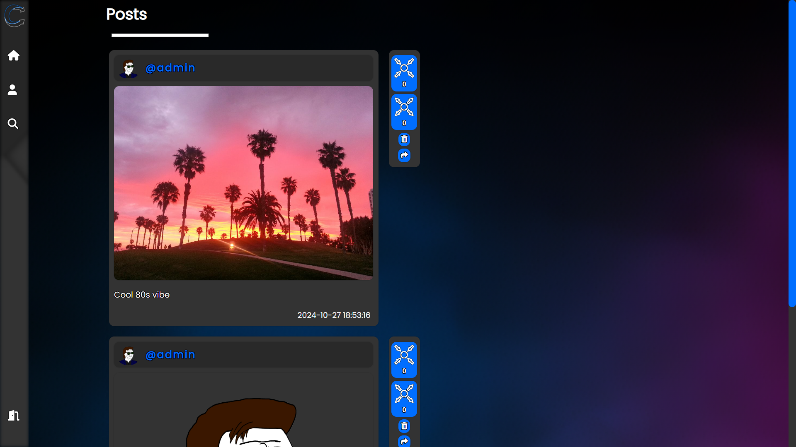
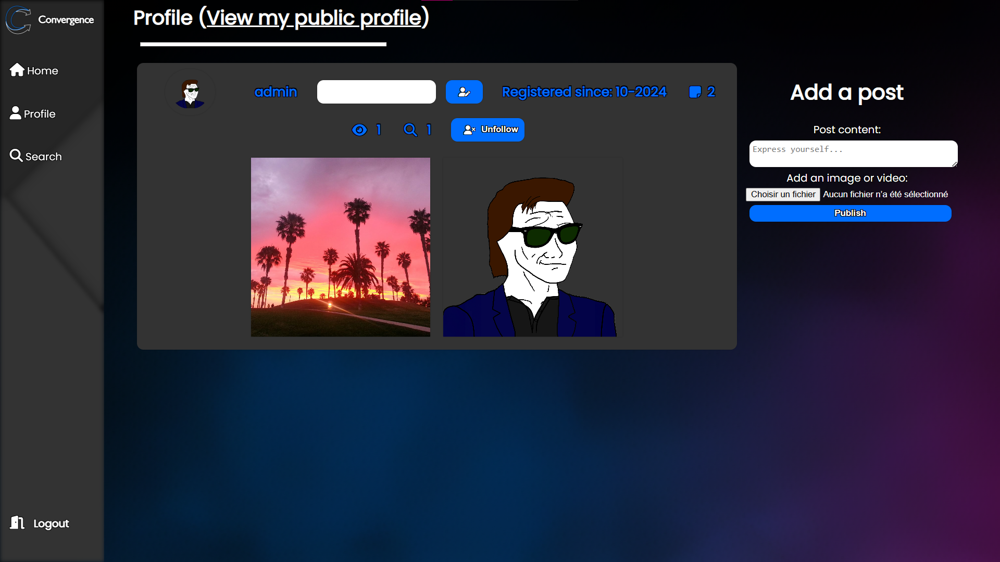

# Convergence

## Summary

- [Convergence](#convergence)
  - [Summary](#summary)
  - [Introduction](#introduction)
  - [Changelog](#changelog)
  - [Contributing to the project](#contributing-to-the-project)
  - [Contributors](#contributors)

## Introduction

Convergence is a social network that allows users to connect and share textual, image or video content.
It is possible to follow other users and see their posts in a news feed.

It is being developed in PHP, HTML, CSS and JavaScript.

  

## Changelog

All notable changes to this project will be documented in the [CHANGELOG.md](CHANGELOG.md) file.

## Contributing to the project

Before starting, please read the [License](LICENSE) to understand the permissions and limitations of the project.
All information related to contributing to the project can be found in the [CONTRIBUTING.md](CONTRIBUTING.md) file. It is **mandatory** to read it before contributing to the project in order to follow the conventions and make the development process easier for everyone. Thank you for your understanding!

## Contributors

-  [Michael "Ace Anderson"](https://github.com/MichaelAceAnderson)
-  [Napacher](https://github.com/Napacher)
-  [JusteSteve](https://github.com/JusteSteve)
